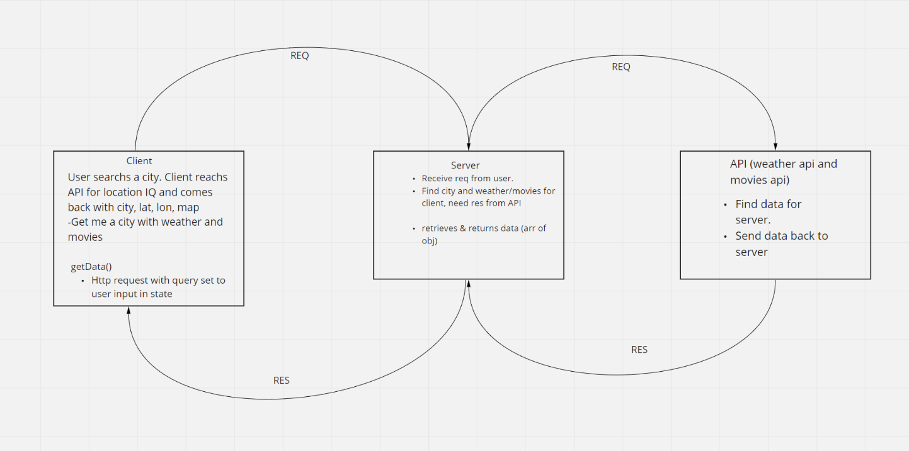

# CityExplorer

**Author**: Kason Braley

**Version**: 1.4.0 

## Overview
A React application that utilizes the Axios library to make
user initiated requests for data from multiple third party APIs.

Provides quick answers to location based queries. Response 
data includes location data (with a map), the weather forecast for
that location, and any related movies to that city.

## Getting Started
1. Clone the project
2. `cd` into the local project folder
3. run `npm install`
4. run `npm start`

## Architecture
**Language**: JavaScript

**Libraries**: React, React Bootstrap, Axios

[Backend](https://github.com/KasonBraley/city-explorer-api)

**API's**: [Location IQ Geocoding API](https://locationiq.com/) 

## Change Log

## Collaborations
**Whiteboarding** - Brandon Rimes, Kyle Cohen, Alexander Beers, Joe Ivans

## Time Estimates

Name of feature: Locations

Estimate of time needed to complete: 1 hour

Start time: 4pm

Finish time: 6:30pm

Actual time needed to complete: 2 and a half hours

Name of feature: Map

Estimate of time needed to complete: 1 hour

Start time: 7pm

Finish time: 8:30pm

Actual time needed to complete: 1 hour

Name of feature: Errors

Estimate of time needed to complete: 1 hour

Start time: 8pm

Finish time: 9pm

Actual time needed to complete: 1 hour
